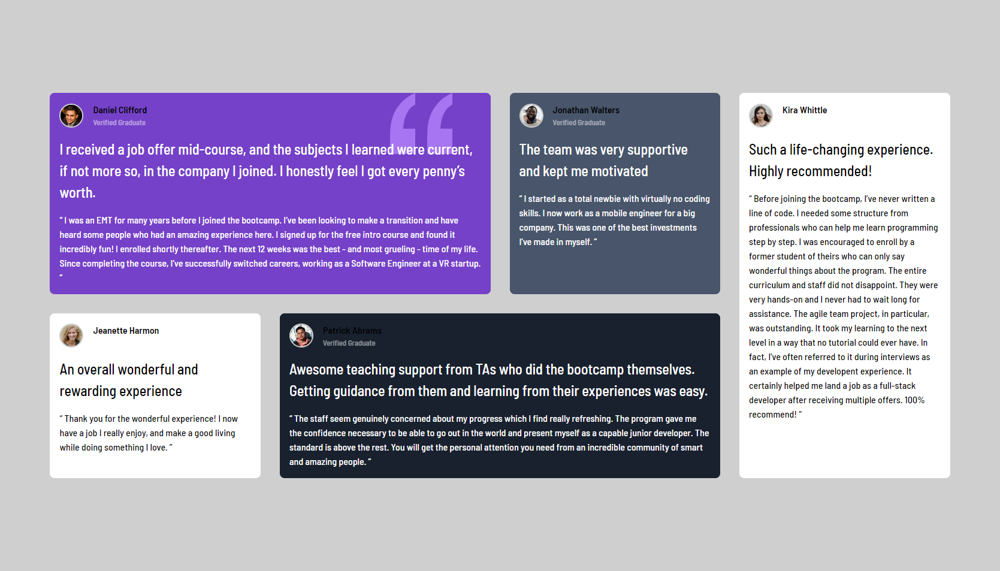

# Frontend Mentor - Testimonials grid section

---

## Welcome!👋

This is a solution to the [Social links profile challenge on Frontend Mentor](https://www.frontendmentor.io/challenges/social-links-profile-UG32l9m6dQ). Frontend Mentor challenges help you improve your coding skills by building realistic projects.

## [m07mmmad-nasr's solution](https://github.com/m07mmad-nasr/testimonials-grid-section-challenge-12)

## Overview

### Screenshot

#### Desktop

#### Mobile

.png>)

### Links

- Solution URL: [Solution](https://github.com/m07mmad-nasr/testimonials-grid-section-challenge-12)
- Live Site URL: [Live Site](https://testimonials-grid-section-challenge-12.vercel.app/)

## My process

### Built with

- Semantic HTML5 markup
- CSS custom properties
- Flexbox
- SASS
- Mobile-first workflow

**Have fun building!** 🚀
